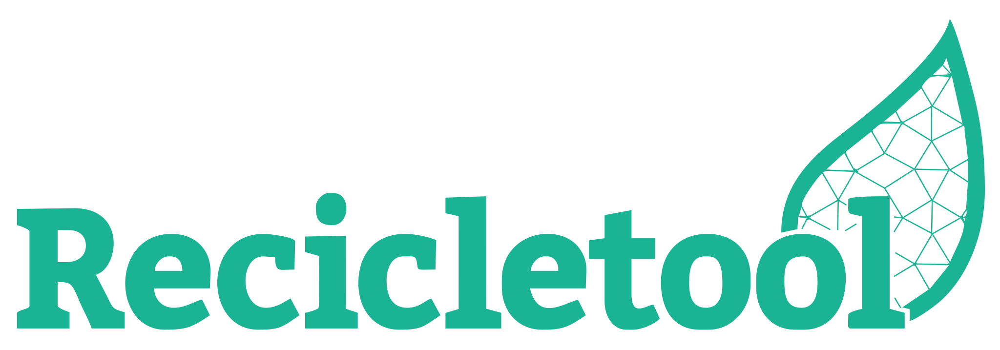

<h1 align="center">
 
  
 
 
Recicletool App
</h1>

Migração do app da Recicletool para ReactNative

  
  

  <a href="#sobre-a-Recicletool">Sobre a Recicletool</a>&nbsp;&nbsp;&nbsp;|&nbsp;&nbsp;&nbsp;
  <a href="#recursos">Recursos</a>&nbsp;&nbsp;&nbsp;|&nbsp;&nbsp;&nbsp;
  <a href="#licença">Licença</a>

[//]: # (Add your gifs/images here:)
[//]: # (
)
[//]: # (  )
[//]: # (  )
[//]: # (
)

## Sobre a Recicletool
Um equipamento automatizado que identifica resíduos recicláveis e clientes depositantes, utilizando tecnologia brasileira para gerar informações a partir da logística reversa de embalagens, no pós-consumo.

## Recursos
[//]: # (Add the features of your project here:)
- :memo: Cadastro de novos usuários
- :earth_americas: Navegação por mapa
- :bookmark_tabs: Extrato de depositos e saques
- :heavy_dollar_sign: Solicitação e emissão de cupons de desconto por código de barras.

## Licença

This project is licensed under the MIT License - see the [LICENSE](https://opensource.org/licenses/MIT) page for details.